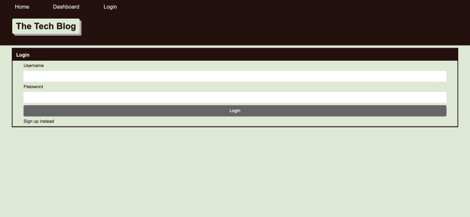

# MVC-Tech-Blog

## Description

A CMS-style blog site where developers can publish and comment on posts. 

## Table of Contents

&bull; [Installation & Testing](#installation--testing) 
&bull; [Usage](#usage) 
&bull; [License](#license) 
&bull; [How to Contribute](#how-to-contribute) 
&bull; [Questions](#questions)

## Installation & Testing

&bull; Clone the repository to your local machine. 
&bull; Install the Node dependencies by running `npm install` in the root directory of the project. 
&bull; Seed the database by running `npm seed`. This will populate the database with some initial data. 
&bull; Make sure to create a MySQL database,`USE` it, `SOURCE` the schema.sql file, and configure database access in the .env file. This is necessary for the application to connect to the database and interact with it. 
&bull; Start the server by running `npm start`, then open `localhost:3001` in your browser to access the application.

## Usage

Deployed application: [https://mbartnett-mvc-tech-blog.herokuapp.com/](https://mbartnett-mvc-tech-blog.herokuapp.com/)

  
  
  
  
  

## License

Copyright © 2022, Michael Bartnett, edX Boot Camps LLC. Distributed under the [MIT](https://opensource.org/licenses/MIT) License. 

## How to Contribute

If you have a suggestion that would make this application better, please fork the repo and create a pull request.

## Questions

Contact: mbartnett@gmail.com, [github.com/mbartnett](https://github.com/mbartnett)    
